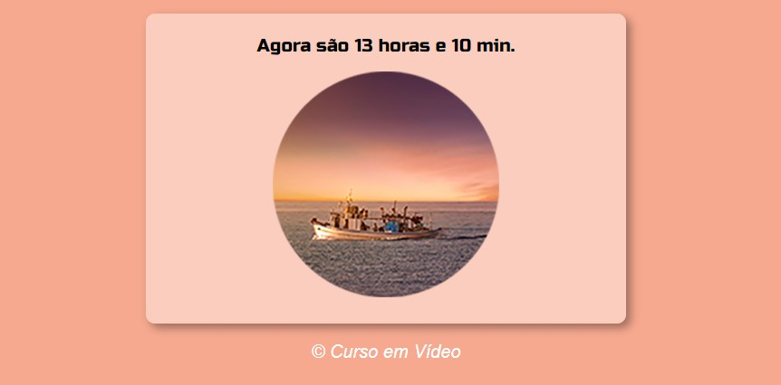
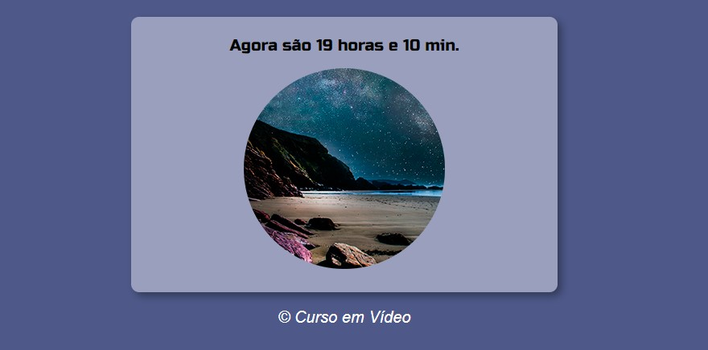

# Página que muda o estilo conforme o período do dia

## Projeto de uma página que muda a imagem e a cor conforme o período do dia (manhã, tarde e noite) feito com HTML, CSS e JavaScript. Projeto realizado com o professor Gustavo Guanabara do Curso em Vídeo.👩🏽‍💻

### [Clique aqui para acessar a página 👇🏽]() 

